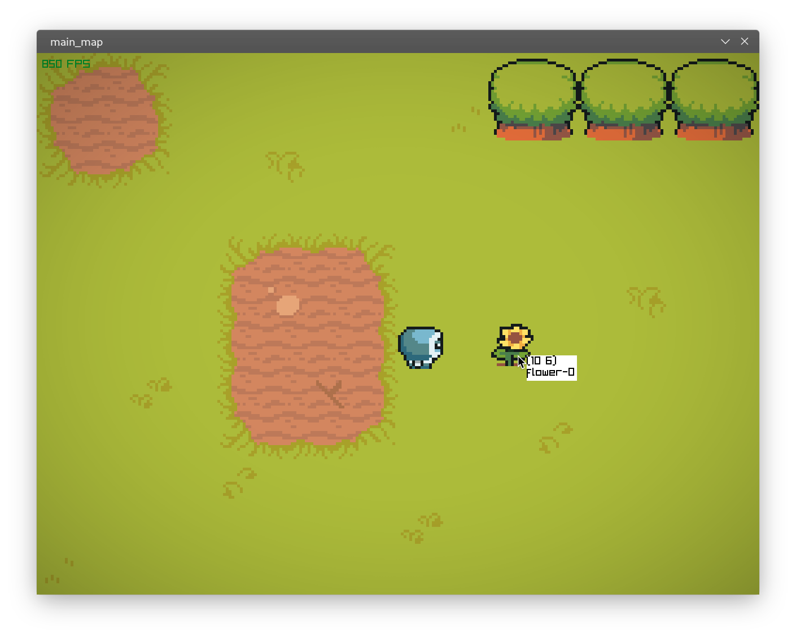

# huh

I honestly have no idea anymore

## Command-line options

`-d`, `--debug`: Start game in debug mode, can also be toggled in-game by pressing `Q`

`-f`, `--fps <value>`: Target framerate. Defaults to signed 32-bit integer limit (practically unlimited).

`-h`, `--help`: Show a help message.

`-r`, `--res <path>`: Set a custom resource folder. Defaults to `../res` (assumes you're executing from the build directory).
Should the program fail to find the resource folder, it will show you an error message.

`-v`, `--vsync`: Enable vertical synchronization.

## Goal

There is none. I'm simply wasting time.

## Current progress

- Super scuffed and awful player control
- Textures, sounds etc. largely thanks to raylib
- Tileset loading
- Dynamic level loading
    - Levels are defined using external files (see res/levels/default.level)
- Registries that make handling resources kinda nice
- It actually compiles and seemingly works fine? (A first for me in this language!)
- Yeah there's nothing interesting here

## Building

why would you

Only tested on Arch Linux, probably works under Windows too, can't test on a Mac.

Inside the project root directory:

`# pacman -S gcc cmake ninja raylib fmt cxxopts` (substitute pacman with your package manager.)

`$ mkdir build && cd build`

`$ cmake .. -G Ninja`

`$ cmake --build .`

`$ ./Game`

If this thing still doesn't build, you aren't missing out on much.

## Credits and used libraries

- 'Ninja Adventure' asset pack: https://pixel-boy.itch.io/ninja-adventure-asset-pack
- The amazing raylib library: https://www.raylib.com/
- raylib-cpp bindings I actually don't really use: https://github.com/robloach/raylib-cpp
- Friendship ended with iostreams, now fmt is my best friend: https://github.com/fmtlib/fmt
- More efficient hash tables: https://github.com/martinus/robin-hood-hashing
- Command line option parsing: https://github.com/jarro2783/cxxopts
- This makes using CMake slightly more bearable, though it's still awful please get me out of this
  hell: https://github.com/cpm-cmake/CPM.cmake
